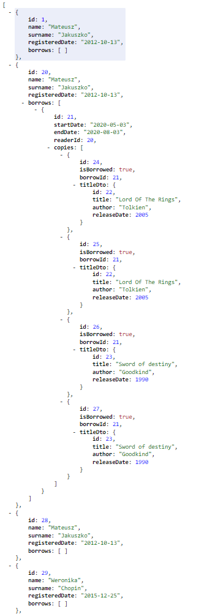
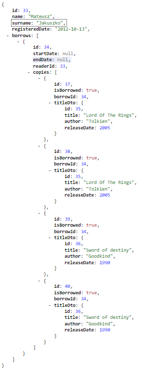
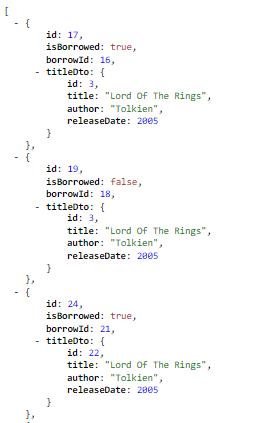
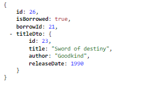
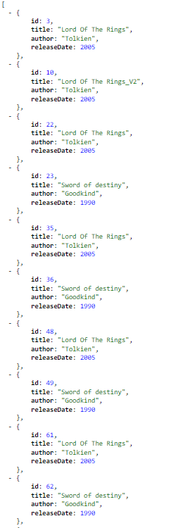
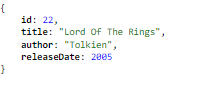
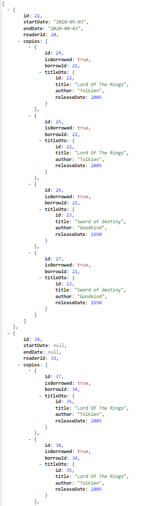
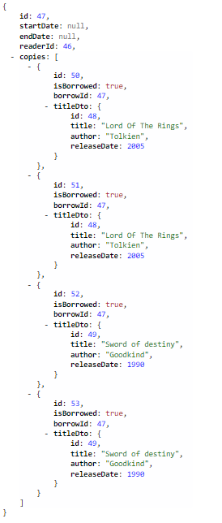

# Library - REST api

## Table of contents
* [Introduction](##Introduction)
* [Api endpoints documentation](##Api endpoints documentation)
* [Technology](##Technology)

## Introduction
### Library is a simple REST api that has the capabilities to:
* Reader
    * create a Reader,
    * update a Reader,
    * delete a Reader,
    * get data about Readers.
* Copy
    * make a Copy,
    * update a Copy,
    * delete a Copy,
    * get data about Copies.
* Title
    * create an Title,
    * update an Title,
    * delete an Title,
    * get data about Titles, 
* Borrow
    * make a Borrow,
    * update a Borrow,
    * delete a Borrow,
    * get data about Borrows.

## Api endpoints documentation
* Reader endpoints
    * Get a list of all readers:
        * Http method - GET
        * Action : receive all readers data list
        * URL : http://localhost:8080/v1/readers
        * Sample of response:
        * 
    * Get a reader by id
        * Http method - GET
        * Action : receive a reader data by id
        * URL : http://localhost:8080/v1/readers/{id}
        * Sample of response:
        * 
    * Create reader
        * Http method - POST
        * Action : create reader and save it into database
        * URL : http://localhost:8080/v1/readers
        * Requirements : RequestBody
    * Update reader
        * Http method - PUT
        * Action : update reader
        * URL : http://localhost:8080/v1/readers
        * Requirements : RequestBody
    * Delete reader by id
        * Http method - DELETE
        * Action - delete reader by id and save it into deleted elements database
        * URL : http://localhost:8080/v1/readers/{id}
        
* Copy endpoints
    * Get a list of all copies:
        * Http method - GET
        * Action : receive all copies data list
        * URL : http://localhost:8080/v1/copies
        * Sample of response:
        * 
    * Get a copy by id
        * Http method - GET
        * Action : receive a copy data by id
        * URL : http://localhost:8080/v1/copies{id}
        * Sample of response:
        * 
    * Create copy
        * Http method - POST
        * Action : create copy and save it into database
        * URL : http://localhost:8080/v1/copies
        * Requirements : RequestBody
    * Update copy
        * Http method - PUT
        * Action : update copy
        * URL : http://localhost:8080/v1/copies
        * Requirements : RequestBody
    * Delete copy by id
        * Http method - DELETE
        * Action - delete copy by id and save it into deleted elements database
        * URL : http://localhost:8080/v1/copies/{id}
        
* Title endpoints
    * Get a list of all titles:
        * Http method - GET
        * Action : receive all titles data list
        * URL : http://localhost:8080/v1/titles
        * Sample of response:
        * 
    * Get a title by id
        * Http method - GET
        * Action : receive a title data by id
        * URL : http://localhost:8080/v1/titles/{id}
        * Sample of response:
        * 
    * Create title
        * Http method - POST
        * Action : create title and save it into database
        * URL : http://localhost:8080/v1/titles
        * Requirements : RequestBody
    * Update title
        * Http method - PUT
        * Action : update title
        * URL : http://localhost:8080/v1/titles
        * Requirements : RequestBody
    * Delete title by id
        * Http method - DELETE
        * Action - delete title by id and save it into deleted elements database
        * URL : http://localhost:8080/v1/titles/{id}
* Borrow endpoints
    * Get a list of all borrows:
        * Http method - GET
        * Action : receive all borrows data list
        * URL : http://localhost:8080/v1/borrows
        * Sample of response:
        * 
    * Get a borrow by id
        * Http method - GET
        * Action : receive a borrow data by id
        * URL : http://localhost:8080/v1/borrows/{id}
        * Sample of response:
        * 
    * Create borrow
        * Http method - POST
        * Action : create borrow and save it into database
        * URL : http://localhost:8080/v1/borrows
        * Requirements : RequestBody
    * Update borrow
        * Http method - PUT
        * Action : update borrow
        * URL : http://localhost:8080/v1/borrows
        * Requirements : RequestBody
    * Delete borrow by id
        * Http method - DELETE
        * Action - delete borrow by id and save it into deleted elements database
        * URL : http://localhost:8080/v1/borrows/{id} 
         
## Technology
- Java 
- JUnit
- Gradle
- Spring
- SpringBoot
- H2 database
- MySQL database
